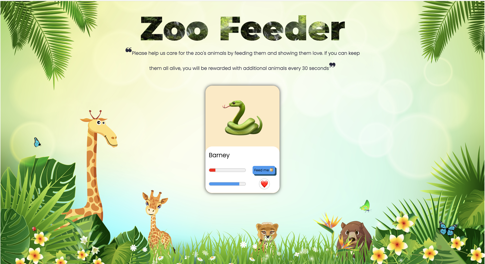
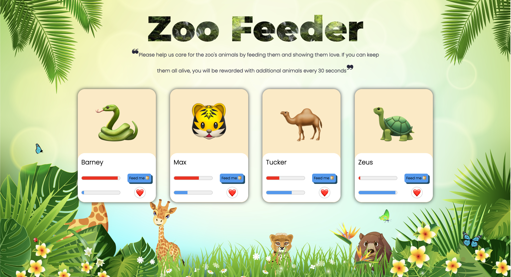
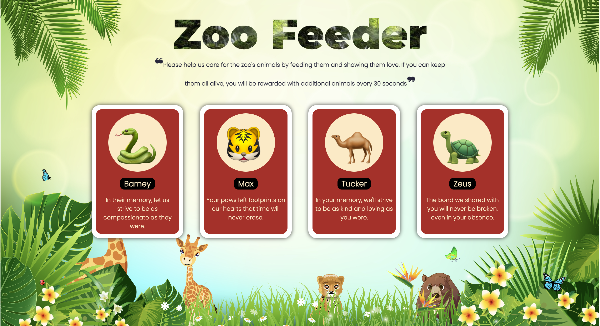

# 🐍 Zoo Feeder App

## :star: App Overview

- 🧑‍🌾 Your mission is to assist the zookeepers in feeding the animals by clicking the "Feed me🍞" button to minimize the animals' hunger level. You can also click the "❤️" button or the animal's picture to maximize their love level.
- 🪦 Over time, the animals' hunger levels increase, and their love levels decrease. Failure to feed them adequately, allowing hunger to peak, or neglecting their need for love may lead to their demise.
- 🎁 Successfully keeping all the animals alive rewards you with a new animal every 30 seconds.

#### LIVE LINK: https://zoo-feeder-fun.netlify.app/

## :camera: Screen Shots





## :computer: Technologies Used

[](https://skillicons.dev)

## :wrench: Setup

1. Clone this repository

```bash
$ git clone https://github.com/giangpham-cfg/Zoo-feeder-project.git
```

2. Go into the repository

```bash
$ cd Zoo-feeder-project
```

3. Install dependencies

```bash
$ npm install
```

4. Run the app

```bash
$ npm run dev
```

## :blue_book: License

[MIT](https://choosealicense.com/licenses/mit/)
